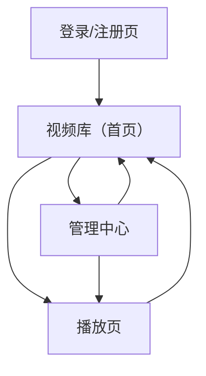

## 1. Product Overview

一个面向内部/小团队的视频管理与播放平台：支持视频浏览播放、播放历史、标签体系、搜索排序分页。
补充要求：必须登录/注册；包含“创作者上传视频”（对象存储 MinIO）与“管理员本地文件夹视频入库”。

## 2. Core Features

### 2.1 User Roles

| 角色   | 注册方式           | 核心权限                                    |
| ---- | -------------- | --------------------------------------- |
| 普通用户 | 邮箱/密码注册        | 登录后浏览/播放视频；记录播放历史；给视频打标签；按条件搜索/排序/分页    |
| 创作者  | 邮箱/密码注册后由管理员提升 | 在普通用户权限基础上：上传视频到 MinIO 并创建视频条目          |
| 管理员  | 由系统初始化/后台配置    | 管理本地文件夹视频入库；管理视频条目（最小编辑/下架）；管理用户角色（创作者） |

### 2.2 Feature Module

本产品由以下核心页面构成：

1. **登录/注册页**：邮箱密码注册、登录、退出。
2. **视频库（首页）**：视频列表、搜索、筛选与排序、分页、进入播放。
3. **播放页**：视频播放、播放进度与历史记录、标签查看与编辑。
4. **管理中心**：
   - 创作者：上传到 MinIO、创建/补全视频元数据。
   - 管理员：本地文件夹扫描/入库、视频条目基础管理、用户角色管理。

### 2.3 Page Details

| Page Name | Module Name  | Feature description                                      |
| --------- | ------------ | -------------------------------------------------------- |
| 登录/注册页    | 注册           | 使用邮箱/密码创建账号；校验必填与格式；注册成功后进入登录态                           |
| 登录/注册页    | 登录与退出        | 使用邮箱/密码登录获取会话；退出时清理会话并返回登录页                              |
| 视频库（首页）   | 访问控制         | 未登录仅展示引导登录入口；登录后可访问列表与播放                                 |
| 视频库（首页）   | 视频列表         | 展示：标题、标签、创建时间、（当前用户）最后播放时间；点击进入播放页                       |
| 视频库（首页）   | 搜索/筛选        | 按标题关键字搜索；按标签筛选；支持组合条件并可一键清空条件                            |
| 视频库（首页）   | 排序/分页        | 按创建时间/最后播放时间排序；升/降序；分页浏览（页码与上一页/下一页）                     |
| 播放页       | 视频播放         | 播放/暂停/进度拖动；加载视频资源；失败时提示“不可播放/资源不存在”                      |
| 播放页       | 播放历史         | 进入播放页时记录“最近播放时间”；播放进度变化时可保存进度秒数（用于下次继续播放）；累计播放次数（或播放事件数） |
| 播放页       | 标签管理         | 展示标签；添加/移除标签；标签去重（大小写/空白等规则由后端统一）                        |
| 管理中心      | 创作者上传（MinIO） | 选择文件上传并展示进度/结果；上传成功后创建视频条目并填写最小字段：标题（必填）、标签（可选）          |
| 管理中心      | 管理员本地入库      | 选择/配置服务器侧已挂载目录；扫描生成候选列表；批量入库生成视频条目（避免重复入库）               |
| 管理中心      | 管理员内容管理      | 对视频条目做最小编辑：标题/标签/下架状态；必要时重新关联存储对象键                       |
| 管理中心      | 管理员用户与角色     | 按邮箱或用户ID检索用户；设置/取消创作者角色；仅管理员可操作                          |

## 3. Core Process

- 普通用户流程：注册/登录 → 进入视频库 → 按关键字/标签筛选并排序 → 分页浏览 → 进入播放页播放 → 系统记录最近播放时间/进度/次数 → 在播放页为视频添加/移除标签 → 返回视频库继续浏览。
- 创作者流程：登录 → 进入管理中心（创作者区） → 上传视频到 MinIO → 填写标题（与可选标签）创建视频条目 → 回到视频库可被检索与播放。
- 管理员流程：登录 → 进入管理中心（管理员区） → 配置服务器本地目录并扫描 → 批量入库生成视频条目 → 必要时编辑/下架 → 维护用户角色（创作者）。

